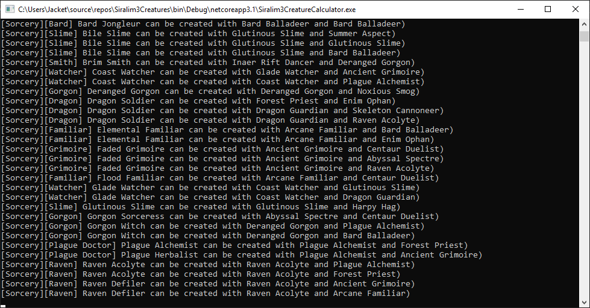
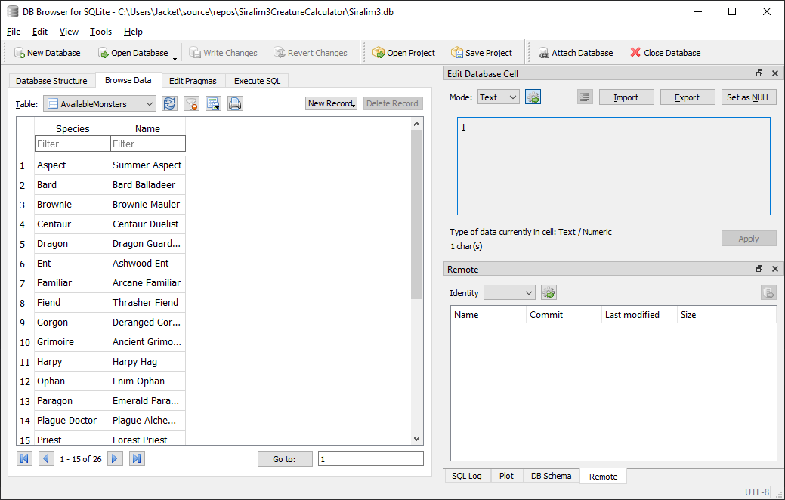

# Siralim 3 Creature Calculator

This C# tool compares a list of all Siralim 3 creature breeding combinations to your own list of available creatures and prints a set of possible combinations for each recipe. This includes recipes that have specific creature requirements and those that allow "any" of a specific species.

The application requires a SQLite database containing two tables. The first is a table containing the creature breeding combinations of Siralim 3. The second table is one for known creatures, that can be populated with the creatures that you have access to. The C# program uses these two tables to print out a full list of all of the combinations available to you. 

  
*Sample output for the application*

## Usage:
Download the repository and ensure you can build the project. You may need to make conversions (listed below under build notes) if you're not using Visual Studio 2019. Once conversions are made, you should run the application once and verify that output looks like the sample output above. In order to modify the SQLite database containing the list of available creatures, I recommend using a free tool such as [DB Browser for SQLite](https://sqlitebrowser.org/). After opening the file in the solution directory, you can modify the AvailableMonsters table as seen below. Make sure you rebuild the application after changing the .db file so that the up-to-date version is copied to the build directory.

  
*Editing the AvailableMonsters table with DB Browser for SQLite*

## Developer Build Notes:
The source contains a Visual Studio 2019 solution and project file, targetting .NET Core 3.1. There's a pre-build step of copying the SQLite file "Siralim3.db" from the solution directory to the build directory. If you're utilizing another process to build or run the application, keep in mind that the program is expecting "Siralim3.db" to be in the runtime location.

## License: MIT